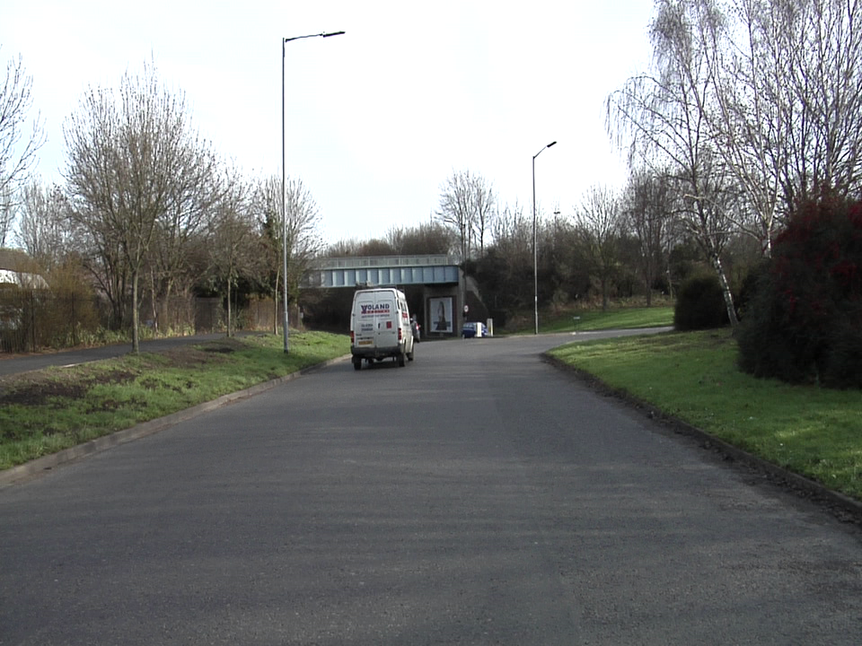

# 人工智能技术基础及应用

本仓库为VSISLAB所编写《人工智能技术基础及应用》一书配套代码

1~3章不涉及实践，无配套代码

## 第四章 卷积神经网络

本章主要介绍经典卷积神经网络结构，训练及测试所用数据集为FashionMNIST，构建Dataloader时会自动下载至目录`chapter_4/data/FashionMNIST`

  

FashionMNIST样本

[FashionMNIST官方仓库](https://github.com/zalandoresearch/fashion-mnist)

## 第五章 序列到序列网络

本章主要介绍经典序列到序列网络，训练及测试所用数据集为aclImdb，需要读者下载至目录`chapter_5/data/aclImdb`

  

正负评价样本

[aclImdb下载地址](http://ai.stanford.edu/~amaas/data/sentiment/aclImdb_v1.tar.gz)

## 第六章 目标检测及其应用

仍在整理中

## 第七章 语义分割及其应用

本章实现城市街景分割实践案例，训练及测试所用数据集为CamVid，需要读者下载至目录`chapter_7/CamVid`

  

原图像

  

语义分割输出

[CamVid官网地址](http://mi.eng.cam.ac.uk/research/projects/VideoRec/CamVid/)

[CamVid亚马逊云下载地址](https://s3.amazonaws.com/fast-ai-imagelocal/camvid.tgz)