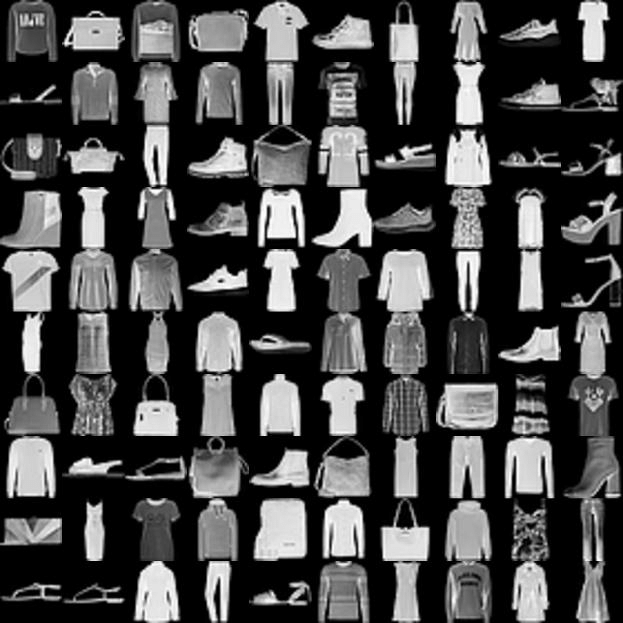
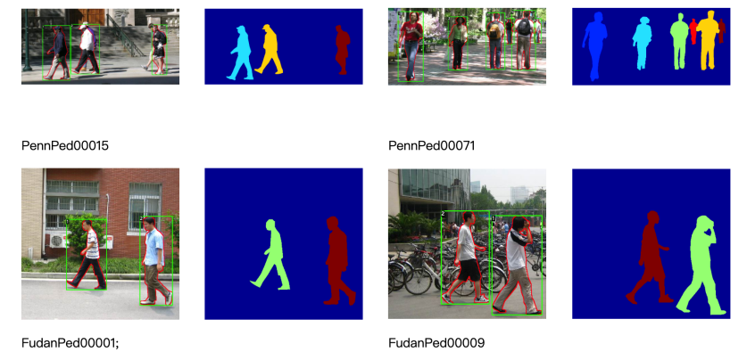

# Basics and Applications of Artificial Intelligence Technology

English | [简体中文](./README.md)

---

This repository is a companion code to the book "Fundamentals and Applications of Artificial Intelligence Techniques" written by VSISLAB

Chapters 1 do not involve practice, no supporting code

## Chapter 2 Neural Network Fundamentals

This chapter mainly introduces the basic design of neural networks, using numpy to implement commonly used modules in neural networks from scratch, and finally building a network that can recognize handwritten digits

## Chapter 3 Deep Learning Computational Framework

This chapter mainly introduces the PyTorch deep learning computing framework and uses PyTorch to implement the network in Chapter 2 in a more concise way.

## Chapter 4 Convolutional Neural Networks

This chapter introduces the classical convolutional neural network structure, the dataset used for training and testing is FashionMNIST, which will be automatically downloaded to the directory `chapter_4/data/FashionMNIST` when building Dataloader

  

    
     
    Sample in FashionMNIST
  

[FashionMNIST](https://github.com/zalandoresearch/fashion-mnist)

## Chapter 5 Sequence2Sequence

This chapter introduces the classical sequence-to-sequence network, the dataset used for training and testing is aclImdb, which needs to be downloaded to the directory `chapter_5/data/aclImdb` by the reader.

    

      
       
      positive and negative review samples
    

[Download aclImdb](http://ai.stanford.edu/~amaas/data/sentiment/aclImdb_v1.tar.gz)

## Chapter 6 Object Detection and its Applications

This chapter implements a practical case of human detection, the dataset used for training and testing is Penn-Fudan, there is download scripts in jupyter notebook

    

      
       
      human detection
    

[Penn-Fudan](https://www.cis.upenn.edu/~jshi/ped_html/)

## Chapter 7 Semantic Segmentation and its Applications

This chapter implements a practical case of urban street segmentation, the dataset used for training and testing is CamVid, which needs to be downloaded to the directory `chapter_7/CamVid`.

  

    
     
    original image
  

  

    
     
    output of semantic segmentation
  

[CamVid](http://mi.eng.cam.ac.uk/research/projects/VideoRec/CamVid/)

[Download CamVid](https://s3.amazonaws.com/fast-ai-imagelocal/camvid.tgz)